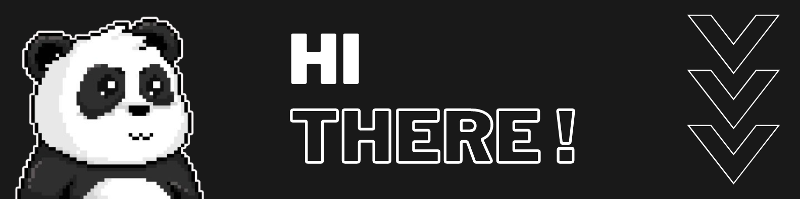

  

### Hello! My name is Beksultan and I am an aspiring Front End developer looking to grow professionally and gain experience in web development. I am interested in the opportunity to join a team where I can apply and develop my skills while working on exciting projects.
### My programming journey began with a passion for web technologies and a desire to create unique and user-friendly user interfaces. Over the past 1.5 years I have been studying and practicing in various areas of Front End development, gaining experience with HTML, CSS and JavaScript, React, Typescript ...
 

## 🛠️ Tools:

  &nbsp;
  &nbsp;
  &nbsp;
  &nbsp;
  &nbsp;
  &nbsp;
  &nbsp;
  &nbsp;
  &nbsp;

 

##  🧩Layout: 

<table width='100%'>
  <tr>
    <td align="center" width="96">
    
       HTML5
    </td>
    <td align="center" width="96">
    
       CSS3
    </td>
    <td align="center" width="96">
       
       Sass
    </td>
    <td align="center" width="96">
      
       Bootstrap
    </td>
    <td align="center" width="96"> 
     
       MUI
    </td>
    <td align="center" width="96"> 
     
       Tailwind
    </td>
  </tr> 
</table>
 

## 👉Technologies:

<table width='100%'>
  <tr>
        <td align="center" width="96">
      
       JavaScript
    </td>
    <td align="center" width="96">
      
       React JS
    </td>
    <td align="center" width="96">
      
       TypeScript
    </td>
          <td align="center" width="96"> 
      
       Next JS
    </td>
      <td align="center" width="96"> 
      
       Redux
    </td>
     <td align="center" width="96"> 
      
       Prisma
    </td>
  </tr> 
</table>
 
 

#### 🤝 Socials:

